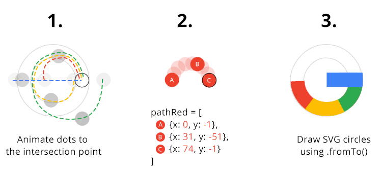
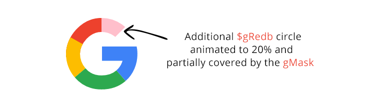
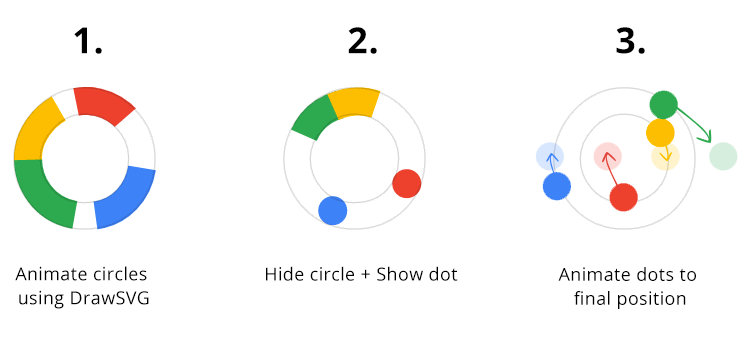

## Setup the code development environment

## Setup the animation preview environment

## Animation design
Here's the final animation:

<p class="codepen" data-height="300" data-default-tab="result" data-slug-hash="QWeMdOY" data-pen-title="Google SVG Logo - GreenSock Animation" data-user="Andy-Zhang-the-encoder" style="height: 300px; box-sizing: border-box; display: flex; align-items: center; justify-content: center; border: 2px solid; margin: 1em 0; padding: 1em;">
  <span>See the Pen <a href="https://codepen.io/Andy-Zhang-the-encoder/pen/QWeMdOY">
  Google SVG Logo - GreenSock Animation</a> by Andy Zhang (<a href="https://codepen.io/Andy-Zhang-the-encoder">@Andy-Zhang-the-encoder</a>)
  on <a href="https://codepen.io">CodePen</a>.</span>
</p>
<script async src="https://cpwebassets.codepen.io/assets/embed/ei.js"></script>

The whole animation sequence can be broken down into 3 parts:

1. Wave animation of the dots
2. Rotate the dots
3. Dots into the letter “G”
4. From “G” back to the dots

### Wave animation of the dots
Each dot has its own timeline, dotWaveTl that moves it to y: -7, y: 7 and then back to y: 0.

All four timelines are then inserted onto a main timeline, dotsWaveTl, with a slight delay.


### Dots into the letter “G”
Steps:
1. work out a path for each of the dots
2. work out a precise timing for each of the dots
3. work out the timing and animation for the straight blue line
4. synchronize dots and line animation



### From “G” back to the dots


## Create the SVG for the animation

## Animation prompt in natural language
### Wave animation of the dots
```
Implement a function waveDots with the following steps:
- Wave four dots: dotBlue, dotRed, dotYellow, and dotGreen
- Movement: from y=0 to y=-7 within 0.4s, then from y=-7 to y=7 within 0.8s, then back to y=0 within 0.4s
- Start times: dotBlue starts 0s, dotRed starts 0.15s, dotYellow starts 0.3s and dotGreen starts 0.45s
- Repeat wave twice
```

### Rotate the dots
```
Implement a function rotateDots with the following steps:
- Rotate the dots: dotBlue, dotRed, dotYellow, and dotGreen
- The path for red dot is: [{x: 0, y: -1},{x: 31, y: -51},{x: 74, y: -1}], duration is 0.9s
- The path for yellow dot is [{x: -41, y: 46},{x: -76, y: 0},{x: -35, y: -46},{x: 14, y: 1}], duration is 1.2s
- The path for green dot is [{x: -67, y: 82},{x: -145, y: 0},{x: -100, y: -46},{x: -43, y: 3}], duration is 1.5s
```

### Dots into the letter “G”
```
Create an animation function called `dotsIntoG` for our Google 'G' logo SVG:

TIMING MAP:
0.0s - Start: .dotBlue moves right (47px, 0.6s)
0.7s - .dotBlue fades out
0.5s - #gLineAnim sweeps in from left (-120px, 0.8s)

1.0s [startDrawingG] Main sequence:

1. #redG:
   - Appears at startDrawingG
   - Draw (71-88% → 0-26%, 0.5s duration)
   - Start drawing -=0.2 (0.2s before its scheduled time)

2. #yellowG:
   - Appears at startDrawingG+0.1s
   - Draw (71-88% → 17-36%, 0.6s duration)
   - Start drawing -=0.45 (0.45s before its scheduled time)

3. #greenG:
   - Appears at startDrawingG+0.1s
   - Draw (71-88% → 36-61%, 0.55s duration)
   - Start drawing -=0.6

4. #blueG:
   - Appears at startDrawingG+0.3s
   - Draw (71-88% → 61-78%, 0.55s duration)
   - Start drawing -=0.55

5. #redGb:
   - Appears at startDrawingG+0.25s
   - Draw (100% → 80%, 0.7s duration, rotates -10° → 0°)
   - Start drawing -=0.22

Dots fade times (from startDrawingG):
- .dotRed: at start
- .dotYellow: +0.1s
- .dotGreen: +0.4s

Line transition (from startDrawingG):
- #gLineAnim fades out at +0.3s
- #gLine appears at +0.3s
```

### From “G” back to the dots
```
Create a GSAP animation function called `getBackToDots` for transitioning elements back to dots. The animation should:

1. Animation sequence should:
   a. Start with a blue line retraction:
      - Move '#gLineMask' x attribute 365px in 0.3s
      - Hide '#gLineMask' and '#gLine' elements
   
   b. Transform colored segments to circles with drawSVG:
      - '#blueG': 56% to 78%
      - '#greenG': 31% to 56%
      - '#yellowG': 12% to 31%
      - '#redG': 0% to 21%
      All in 0.3s with Power0.easeNone

   c. Rotate colored elements:
      - Rotate '#blueG', '#redG', and '#greenG' segments 50 degrees
      - Modify '#greenG' drawSVG to 10%-20%
      - Rotate '#yellowG' 40 degrees and drawSVG to 0%-10%
      - Adjust '#blueG' drawSVG to 50%-60%
      - Collapse '#redG' drawSVG to 0%
      - Rotate '#redGb' with 50 degrees and drawSVG 80%-90%

   d. Sequential dot transitions:
      - '.dotRed': Show at (60, -37), follow [{x: 60, y: -37}, {x: 50, y: 40},{x: 0, y: 0}]
      - '.dotBlue': Show at (51, 53), follow [{x: 51, y: 53}, {x: 15, y: 25},{x: 0, y: 0}]
      - '.dotYellow': Show at (-5, -44), follow [{x: -5, y: -44}, {x: 3, y: -24},{x: 0, y: 0}]
      - '.dotGreen': Show at (-108, -56), follow [{x: -108, y: -56}, {x: -27, y: -47},{x: 0, y: 0}]

   e. Final mask rotation:
      - Rotate '#gMask' 60 degrees with origin at -9 58

2. Technical requirements:
   - Use TimelineMax
   - Implement proper timing with labels 'rotateG' and 'rotateCircles'
   - Use Power0.easeNone for smooth transitions
   - Use Power2.easeInOut/Out where specified
   - Return the timeline object
```

## Generate Animate code

## Improvements and Challenges
1. adjust the timing of the dots into G animation
2. describe the animation in more detail
   1. know the animation technique, such as easing.
3. iterate on the animation prompt
   1. GPT generates the wrong timing, such as: the -= timing means each drawing action starts before its natural sequence point, creating the overlap effect with the previous actions rather than being absolute times from startDrawingG.
4. Provide a prompt template for the animation, such as: svg elements, steps to describe the animation, timing map, and animation function name.


