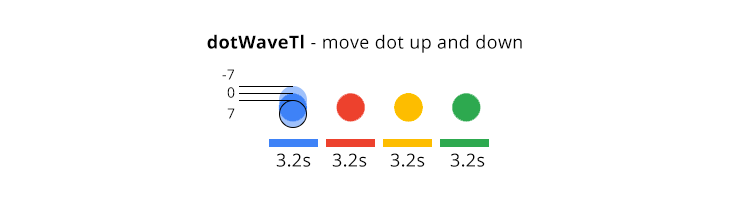

## Setup the code development environment

## Setup the animation preview environment

## Animation design
Here's the final animation:

<p class="codepen" data-height="300" data-default-tab="result" data-slug-hash="PPwqMN" data-pen-title="Google SVG Logo - GreenSock Animation" data-user="ihatetomatoes" style="height: 300px; box-sizing: border-box; display: flex; align-items: center; justify-content: center; border: 2px solid; margin: 1em 0; padding: 1em;">
  <span>See the Pen <a href="https://codepen.io/ihatetomatoes/pen/PPwqMN">
  Google SVG Logo - GreenSock Animation</a> by Petr Tichy (<a href="https://codepen.io/ihatetomatoes">@ihatetomatoes</a>)
  on <a href="https://codepen.io">CodePen</a>.</span>
</p>
<script async src="https://cpwebassets.codepen.io/assets/embed/ei.js"></script>

The whole animation sequence can be broken down into 3 parts:

1. Wave animation of the dots
2. Rotate the dots
3. Dots into the letter “G”
4. From “G” back to the dots

### Wave animation of the dots
Each dot has its own timeline, dotWaveTl that moves it to y: -7, y: 7 and then back to y: 0.

All four timelines are then inserted onto a main timeline, dotsWaveTl, with a slight delay.


### Dots into the letter “G”
Steps:
1. work out a path for each of the dots
2. work out a precise timing for each of the dots
3. work out the timing and animation for the straight blue line
4. synchronize dots and line animation


### From “G” back to the dots


## Create the SVG for the animation

## Animation prompt in natural language
### Wave animation of the dots
```
Implement a function waveDots with the following steps:
- Wave four dots: dotBlue, dotRed, dotYellow, and dotGreen
- Movement: from y=0 to y=-7 within 0.4s, then from y=-7 to y=7 within 0.8s, then back to y=0 within 0.4s
- Start times: dotBlue starts 0s, dotRed starts 0.15s, dotYellow starts 0.3s and dotGreen starts 0.45s
- Repeat wave twice
```

### Rotate the dots
```
Implement a function rotateDots with the following steps:
- Rotate the dots: dotBlue, dotRed, dotYellow, and dotGreen
- The path for red dot is: [{x: 0, y: -1},{x: 31, y: -51},{x: 74, y: -1}], duration is 0.9s
- The path for yellow dot is [{x: -41, y: 46},{x: -76, y: 0},{x: -35, y: -46},{x: 14, y: 1}], duration is 1.2s
- The path for green dot is [{x: -67, y: 82},{x: -145, y: 0},{x: -100, y: -46},{x: -43, y: 3}], duration is 1.5s
```

### Dots into the letter “G”
```
Implement a function dotsIntoG with the following steps:
- Move dotBlue 47 pixels to the right duration 0.6, gLineAnim becomes visible instantly, dotBlue disappear shortly after the gLineAnim appears, then gLineAnim animate from 120 pixels left of its final position over 0.8 seconds and gLineAnim slightly overlap with the blue dot's disappearance
- Add a label 'startDrawingG' at 1 second into the timeline,
Set the gRed to be fully visible instantly at the 'startDrawingG' label, Animate gRed using drawSVG, starting from 71% to 88% and ending at 0% to 26% over 0.5 seconds, start the drawSVG animation 0.2 seconds before the previous animation ends, Set dotRed to be invisible at the same time as 'startDrawingG' label
- Set the gYellow to be fully visible 0.1 after the 'startDrawingG' label, Animate gYellow using drawSVG, starting from 71% to 88% and ending at 17% to 36% over 0.6 seconds, start the drawSVG animation 0.45 seconds before the previous animation ends, set dotYellow to be invisible 0.1 after the 'startDrawingG' label
- Set the gGreen to be fully visible 0.1 after the 'startDrawingG' label, Animate gGreen using drawSVG, starting from 71% to 88% and ending at 36% to 61% over 0.55 seconds, Start the drawSVG animation 0.6 seconds before the previous animation ends, Set dotGreen to be invisible 0.4 after the 'startDrawingG' label
- Set the gLineAnim to be fully invisible 0.3 after the 'startDrawingG' label, Set the gLine to be fully visible 0.3 after the 'startDrawingG' label, set the gBlue to be fully visible 0.3 after the 'startDrawingG' label, animate gBlue using drawSVG, starting from 71% to 88% and ending at 61% to 78% over 0.55 seconds, Start the drawSVG animation 0.55 seconds before the previous animation ends
- Set the gRedb to be fully visible 0.25 after the 'startDrawingG' label, animate the ending red part of the 'G' over 0.7 seconds, start with a rotation of -10 degrees and drawSVG at "100% 100%", end with a rotation of 0 degrees and drawSVG at "80% 100%", start the drawSVG animation 0.22 seconds before the previous animation ends
```

### From “G” back to the dots

## Generate Animate code

## Improvements


