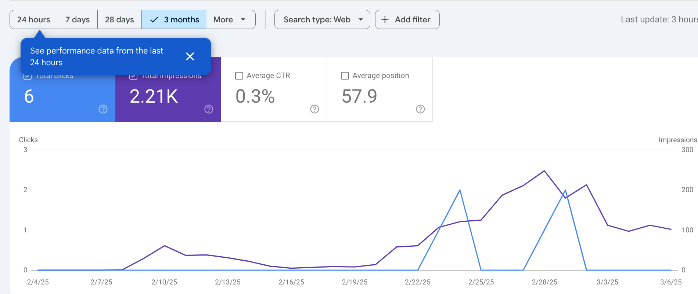
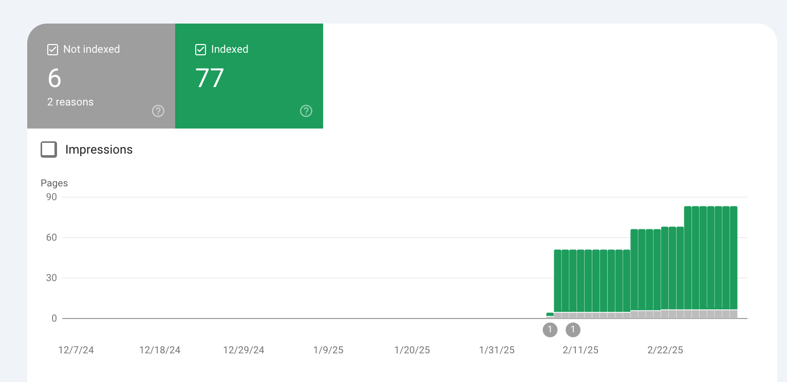

## Why I built directory?  
I want to build a passive income with valuable tool or website. At the same time, I am new to web development. So I want to learn build a well designed website with the help of cursor. I choose this niche because I am also an AMI-trained Montessori educator and dad. So I decided to build my first directory—a platform to help parents easily find the best childcare: **[DaycareSpot](https://www.daycarespot.com/)**.  

## 💡 Tech Stack I Used  
- ◇ **[@supabase](https://supabase.com/)** – Database & Realtime  
- ◇ **[@vercel](https://vercel.com/)** – Hosting  
- ◇ **[@nextjs](https://nextjs.org/)** – Framework  
- ◇ **[@shadcn](https://shadcn.dev/)** – UI  

## **Building a Directory is Easier Than Ever… Thanks to AI**  
Nowadays, with **powerful AI tools**, you don’t even need coding experience to build a directory. There are also **no-code options** like Frey recommended using **WordPress templates**.  

I spent **one month** building my directory. In reality, I could have launched the first version in just a few days—but I care deeply about **design and user experience**, so I focused on refining it. I finally launched in early **February** (I wish I had launched it earlier!).  

## **The Hardest Part? Getting Traffic.**  
Fast forward **one month after launch…**  

### 📊 Google Search Console Stats:  
- **2.21K** impressions  
- **6 clicks**  
- **Only 77 pages indexed** out of **1000+ submitted**  

## **What I’ve Done So Far for SEO**  
✅ Doing **keyword research & on-page optimization**  
✅ Writing **weekly blogs**  
✅ Creating **social media accounts** to build awareness  

## **What I Haven’t Done Yet?**  
❌ **Building backlinks** (I heard low-quality link submission isn’t worth it, but I’m still figuring it out.)  

## **My Key Takeaways So Far:**  
🚀 **Building the directory is the easiest part—getting traffic is the hardest.** SEO, content, and outreach take real effort.  

📦 **Ship your directory fast & early.** No matter what tech stack or template you use, just **launch first and optimize later**.  

💬 **Find a community like Frey's https://ship-your-directory.circle.so/ to stay motivated & learn.** Seeing others share their growth strategies is inspiring!  

---

I’ll be sharing **all my experiments & growth data for the next 30 days** on **Twitter (@neo2bin)**, so if you’re interested in seeing **what works (and what doesn’t)**, follow along!  

**Let’s grow together!** 💡📈  

---